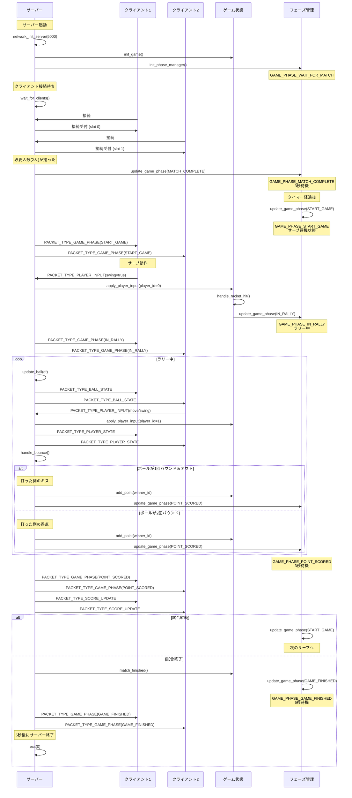

# Prince of Tennis Server - シーケンス図

このドキュメントは、テニスゲームサーバーの動作フローを示すシーケンス図です。

## ゲーム全体のシーケンス図

## 主要なコンポーネント

### ゲームフェーズ (GamePhase)

1. **GAME_PHASE_WAIT_FOR_MATCH**: プレイヤー接続待ち
2. **GAME_PHASE_MATCH_COMPLETE**: マッチング完了（3秒待機）
3. **GAME_PHASE_START_GAME**: サーブ待機状態
4. **GAME_PHASE_IN_RALLY**: ラリー中
5. **GAME_PHASE_POINT_SCORED**: 得点後（3秒待機）
6. **GAME_PHASE_GAME_FINISHED**: 試合終了（5秒待機後サーバー終了）

### パケットタイプ

- **PACKET_TYPE_PLAYER_INPUT**: クライアントからの入力（移動、スイング）
- **PACKET_TYPE_BALL_STATE**: ボールの座標情報
- **PACKET_TYPE_PLAYER_STATE**: プレイヤーの座標情報
- **PACKET_TYPE_GAME_PHASE**: ゲームフェーズの変更通知
- **PACKET_TYPE_SCORE_UPDATE**: スコア更新通知

### 得点判定ロジック

ラリー中 (GAME_PHASE_IN_RALLY) のみ判定が行われます：

1. **1回バウンド＆コートアウト**: 打った側のミス → 相手の得点
2. **2回バウンド（ツーバウンド）**: 返せなかった → 打った側の得点

### タイマー設定

- **TIME_MATCH_COMPLETE**: 2秒 - マッチング完了後の待機時間
- **TIME_AFTER_POINT**: 3秒 - 得点後から次のサーブまでの時間
- **TIME_GAME_FINISHED**: 5秒 - 試合終了後のサーバーシャットダウンまでの時間
